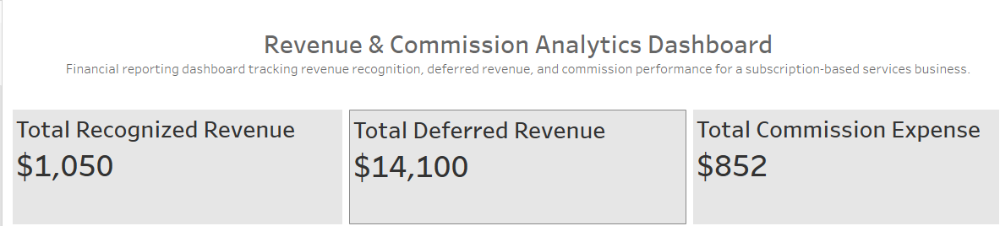
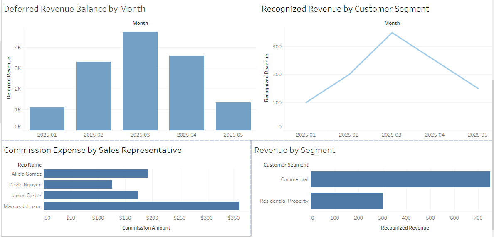

# Revenue & Commission Analytics System

## Overview

This project simulates a real-world financial analytics environment for a subscription-based services business. It reflects core financial operations including revenue recognition, commission calculations, deferred revenue tracking, and month-end close reporting.

The goal of this project is to build a scalable financial analytics system that improves financial accuracy, enhances compensation transparency, and supports data-driven decision-making across Finance, Sales, and Operations.

---

## Business Objectives

- Ensure accurate commission calculations across sales teams  
- Align revenue recognition with contract terms and financial reporting standards  
- Track deferred revenue and future earnings obligations  
- Improve visibility into financial performance and key metrics  
- Streamline month-end close processes through structured reporting  

---

## Dashboard Preview

This dashboard provides a high-level financial overview followed by detailed revenue and commission analysis.

### Overview



### Detailed Analysis



### Overview (KPIs)


### Detailed Analysis


---

## Key Metrics

- **Total Recognized Revenue** – Revenue earned over time based on contract terms  
- **Total Deferred Revenue** – Remaining unearned revenue to be recognized in future periods  
- **Total Commission Expense** – Total sales compensation tied to contract acquisition  

---

## Project Components

### Commission Calculation Model
- Calculates commissions based on contract value and commission rates  
- Supports multiple deal types (new vs renewal)  
- Includes validation checks to ensure accuracy  

### Revenue Recognition Model
- Allocates revenue across the contract lifecycle  
- Separates recognized vs deferred revenue  
- Simulates subscription-based financial reporting practices  

### Deferred Revenue Tracking
- Tracks unearned revenue balances over time  
- Supports forecasting and financial planning  

### Financial Reporting Dashboard
- Visualizes revenue trends and financial performance  
- Analyzes commission expenses and sales performance  
- Tracks deferred vs recognized revenue  
- Provides insight into customer segmentation  

### SQL Data Analysis
- Aggregates revenue by month  
- Calculates commission expense  
- Supports month-end financial reporting workflows  

---

## Tools & Technologies

- **SQL** – Data extraction, joins, and financial aggregation  
- **Excel** – Commission modeling and revenue calculations  
- **Tableau** – Dashboard development and data visualization  
- **Data Modeling** – Structured financial datasets for reporting  

---

## Project Structure

```text
revenue-commission-analytics/
├── data/
│   ├── customers.csv
│   ├── contracts.csv
│   ├── sales_reps.csv
│   ├── commissions.csv
│   └── revenue_schedule.csv
├── sql/
│   ├── 01_revenue_by_month.sql
│   ├── 02_commission_calculations.sql
│   └── 03_month_end_close_summary.sql
├── excel_models/
│   └── commission_model_notes.md
├── dashboards/
│   └── dashboard_design_notes.md
├── images/
│   ├── dashboard_top.png
│   └── dashboard_bottom.png
└── README.md
```


---

## Key Insights

- Identified potential inconsistencies in commission structures that could lead to overpayment  
- Highlighted timing differences between contract execution and revenue recognition  
- Improved visibility into deferred revenue and future earnings  
- Demonstrated how structured reporting improves financial accuracy and efficiency  

---

## Business Impact

This project demonstrates how a financial analytics system can:

- Improve commission accuracy and transparency  
- Support revenue recognition best practices  
- Reduce manual effort in month-end close processes  
- Enable better cross-functional alignment between Finance and Sales  

---

## About

This is a simulated project designed to reflect real-world financial analytics workflows in subscription-based and contract-driven business environments.

---

## Author

**Dione Lucero**  
Data Analyst | Financial Analytics | SQL • Tableau • Excel  
